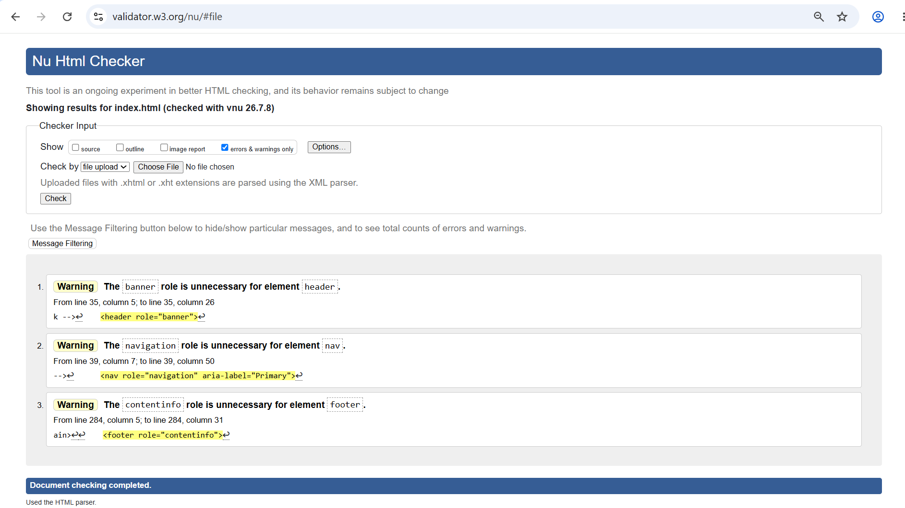
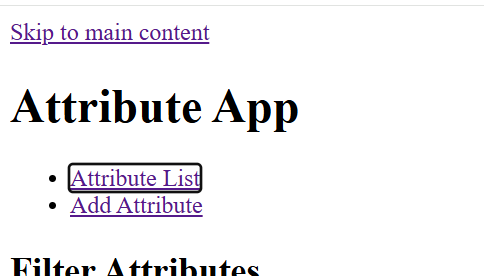
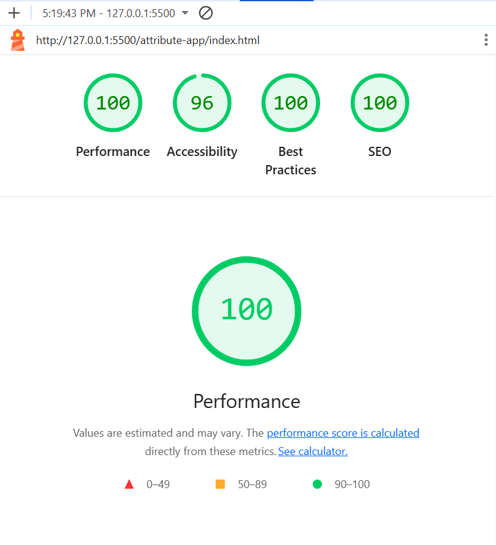
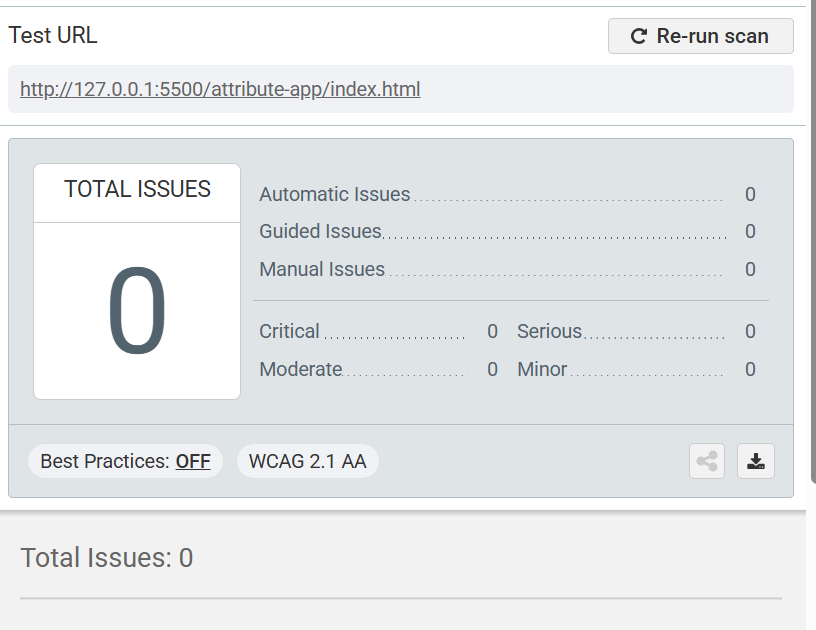

# AFDP 2026 Batch
Name - Anurag Chandra
Training - Path 2

# HTML Assignment

## Task 1

 

### Why does the order of `<meta charset>` matter ?

    The browser must see the character encoding within the first 1024 bytes ot the HTML
    document. If it is placed after any title and description, the browser might use default
    encoding and it might start rendering in that default encoding and when it sees the charset
    lower down in the document, re-renders the page using the mentioned encoding which 
    eventually slows down the page and cause performance and issue or glitchy start.

### What does `<meta name = "theme-color">` control on mobile devices ?

    This tag controls browsers'UI for that website like it can control and affect address bar
    and tab management border etc but only on mobile as it doesn't usually affect browsing in 
    desktop and it is only temporary while browsing the website only and in mobile only.

## Task 2 & 4

### When does `<section>` need an accessible name (aria-labelledby or aria-label) to register as a landmark? 

   By default, a `<section>` is treated as a generic structural block, but to be formally recognized as a navigable "Region Landmark" by assistive technologies, it must be given an accessible name, typically by linking it to its inner heading using `aria-labelledby="..."`.

### What functional issues does a top-level skip-link solve?
   
   A skip-link solves navigation fatigue. Keyboard-only and screen reader users would otherwise be forced to Tab through the entire global header and navigation menu every single time the page reloads just to reach the main workspace. The skip-link allows them to jump directly to `<main>`.

### Why is the "Delete" action constructed as a nested `<form method="POST">` rather than a standard `<a>` link?

    HTTP GET requests (like standard anchor links) are meant to be idempotent—they should only retrieve data, not destroy it. If "Delete" is a link, automated web crawlers or malicious cross-site request forgery (CSRF) scripts could accidentally trigger the URL and systematically delete database records. Forcing it into a POST form prevents accidental or automated data destruction.

## Task 5 & 6
 
### Browser Testing Observations

* **With `novalidate` applied:** Submitting the form with empty required fields results in no visible browser warnings. The form submission is silently blocked, leaving the user without immediate alert.

    

* **With `novalidate` removed:** The browser natively blocks the submission and displays a default popup (e.g., "Please fill out this field") pointing to the first invalid input.
 
### The Three Layers of Validation

1. **HTML Layer:** Provides instant UX feedback (like `required` or `pattern`). A determined user can easily bypass this by opening Browser DevTools and simply deleting the attributes from the DOM.
2. **JavaScript Layer:** Handles complex UI error states and logic. This can be bypassed if a user disables JavaScript in their browser or uses an API client like cURL/Postman to send requests directly.
3. **Server Layer:** This is the non-negotiable layer. Server-side validation cannot be bypassed by the client. It is required in production to enforce data integrity and block malicious payloads (like SQL injection) from entering the database.

## Task 7

### What does `<time datetime="...">` give you that a `<span>` does not?

    A standard `<span>` is just a visual container with no semantic meaning. The `<time>` element combined with the `datetime` attribute provides a strictly formatted, machine-readable timestamp (like ISO 8601). This guarantees that screen readers, search engine scrapers, and software integrations (like calendar tools) can precisely understand the specific date and time, regardless of how it is visually formatted for human users.


## Task 8

### Page 1: Attribute List (`index.html`)

    I chose a traditional dashboard layout with filters at the top, a data table in the center, and a small statistics panel on the side. I avoided a card layout because tables make it easier to compare data, and a filter sidebar because it reduces space for the table. The search bar and first rows are visible above the fold so users can quickly find records. On mobile, I would collapse the filters into a toggle button and replace the table with stacked cards.
 
### Page 2: Add Attribute Form (`add-attribute.html`)

    I used a simple single-column form with three fieldsets to keep the layout clear and accessible. I avoided a multi-step form because there aren't many fields, and a two-column layout because it makes navigation less intuitive. The main fields are above the fold so users can start entering data immediately. On mobile, all inputs would be full width with larger touch targets.
 
### Page 3: Edit Attribute Form (`edit-attribute.html`)

    The edit page follows the same layout as the add form but includes read-only record details at the top for context. I avoided inline table editing because it complicates validation and accessibility, and I didn't use a modal because managing focus can be difficult. The record details and main editable fields appear above the fold so users can confirm they're editing the correct item. On mobile, I'd add a sticky Update button at the bottom for easier saving

## Task 9

### W3C Validation

    There 3 warnings by W3C validation
   

   These warnings are given because there is no need to define role to semantic tags

### Keyboard Navigation

    Tested on every page it is working fine
   

### Lighthouse 

  

   96% accessibility achieved and the reason it did not reach 100% is beacause of accessing nav links inside `<ul> & <li>` tags otherwise it is reaching 100% if you only use `<a>`.

### Axe devtools

   No issues found
  


## Task 10

### Bug B
The icon-only buttons need visually hidden text for screen readers. This is the CSS snippet that will be added to our stylesheet in Assignment 2 to handle `.sr-only` elements:
 
    ```css
        .sr-only {
            position: absolute;
            width: 1px;
            height: 1px;
            padding: 0;
            margin: -1px;
            overflow: hidden;
            clip: rect(0, 0, 0, 0);
            white-space: nowrap;
            border: 0;
        }
