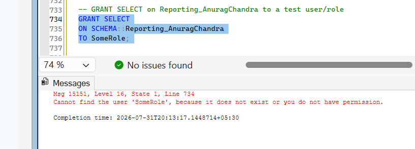

# SQL Assignment 1.

Name - Anurag Chandra
Technical - AFDP 2026 Path 2 

## TABLES CREATED

* TABLE: BusinessUnit_AnuragChandra
* TABLE: CustomerLocation_AnuragChandra
* TABLE: Company_AnuragChandra
* TABLE: Attribute_AnuragChandra

## TASK 1

We will not create a separate Database for the assignments but we will create tables inside TrainingDB only.

## TASK 2

### Tables we have created and reasons for selecting the specific datatype

### Table: BusinessUnit_AnuragChandra

Data Type Choices:
- BusinessUnitId: INT PRIMARY KEY IDENTITY because the number of business units is expected to remain well within the INT range. BIGINT would consume more storage without providing practical benefit.
- BusinessUnitName: NVARCHAR(100) to support Unicode characters, allowing names in multiple languages.
- IsActive: BIT because it stores only True/False values.
- CreatedOn: DATETIME2 because it provides better precision and a larger date range than DATETIME.
- CreatedBy: NVARCHAR(100) to support usernames containing Unicode characters.

* Using VARCHAR instead of NVARCHAR could prevent storing multilingual names correctly.
* Using BIGINT instead of INT would increase storage requirements unnecessarily.
* Using DATETIME instead of DATETIME2 would reduce precision and provide a smaller supported date range.

### Table: CustomerLocation_AnuragChandra

Data Type Choices:
- CustomerLocationId: INT IDENTITY for an efficient auto-generated primary key.
- CustomerLocationName: NVARCHAR(100) to support international location names.
- BusinessUnitId: INT because it references BusinessUnit.BusinessUnitId.
- IsActive: BIT for active/inactive status.
- CreatedOn: DATETIME2 for precise timestamp storage.
- CreatedBy: NVARCHAR(100) for Unicode usernames.

* The foreign key must use the same data type as the referenced primary key. Using a different numeric type would prevent the foreign key relationship.

### Table: Company_AnuragChandra

Data Type Choices:
- CompanyId: INT IDENTITY for an efficient auto-generated primary key.
- CompanyName: NVARCHAR(100) to support Unicode company names.
- IsActive: BIT for active/inactive status.
- CreatedOn: DATETIME2 for precise timestamp storage.
- CreatedBy: NVARCHAR(100) for Unicode usernames.

* The primary key uses INT for efficiency, while NVARCHAR supports multilingual company names.

### Table: Attribute_AnuragChandra

Data Type Choices:
- AttributeId: INT IDENTITY for an efficient auto-generated primary key.
- AttributeName: NVARCHAR(100) to support Unicode attribute names.
- BusinessUnitId, CustomerLocationId, CompanyId: INT to match their referenced primary keys.
- IsActive: BIT for active/inactive status.
- CreatedOn, UpdatedOn: DATETIME2 for precise timestamp storage.
- CreatedBy, UpdatedBy: NVARCHAR(100) for Unicode usernames.

* Foreign keys use INT to match the referenced primary keys, and DATETIME2 provides higher precision for audit fields.

## TASK 3 : Adding Constraints

Required Fields:
NOT NULL is used for mandatory business and audit fields.
UpdatedOn and UpdatedBy are optional because they are populated only after a record is updated.

### BusinessUnit
* BusinessUnitName, IsActive, CreatedOn, and CreatedBy are marked as NOT NULL because they are required to create a valid business unit record.
* IsActive defaults to 1 so new business units are active by default.
* CreatedOn defaults to GETDATE() to automatically store the record creation time.
* A CHECK constraint ensures CreatedOn cannot be a future date.

### CustomerLocation
* CustomerLocationName, BusinessUnitId, IsActive, CreatedOn, and CreatedBy are marked as NOT NULL because they are required for a valid customer location.
* IsActive defaults to 1 for newly created records.
* CreatedOn defaults to GETDATE() to record the creation timestamp automatically.
* A CHECK constraint ensures CreatedOn is not greater than the current date.

### Company
* CompanyName, IsActive, CreatedOn, and CreatedBy are marked as NOT NULL because they are mandatory fields.
* IsActive defaults to 1 so companies are active by default.
* CreatedOn defaults to GETDATE() to capture the creation timestamp.
* A CHECK constraint prevents future dates from being stored in CreatedOn.

### Attribute
* AttributeName, BusinessUnitId, CustomerLocationId, CompanyId, IsActive, CreatedOn, and CreatedBy are marked as NOT NULL because they are required to uniquely identify and track an attribute.
* UpdatedOn and UpdatedBy are kept nullable since they are populated only after a record is updated.
* IsActive defaults to 1 and CreatedOn defaults to GETDATE().
* A CHECK constraint ensures CreatedOn is not a future date.
* A composite UNIQUE constraint on (BusinessUnitId, AttributeName) prevents duplicate attribute names within the same business unit while allowing the same attribute name in different business units.

### Checking constraints

    INSERT INTO BusinessUnit_AnuragChandra
    (BusinessUnitName, IsActive, CreatedOn)
    VALUES
    ('Paper', 1, GETDATE());

Cannot insert the value NULL into column 'CreatedBy', table 'TrainingDB.EnterpriseApprovalUser.BusinessUnit_AnuragChandra'; column does not allow nulls. INSERT fails.

    INSERT INTO BusinessUnit_AnuragChandra
    (BusinessUnitName, CreatedBy)
    VALUES
    ('Paper', 'Anurag');

All other data gets filled with default values.

    INSERT INTO BusinessUnit_AnuragChandra
    (BusinessUnitName, IsActive, CreatedOn, CreatedBy)
    VALUES
    ('Paper', 1, '2099-01-01', 'Anurag');

The INSERT statement conflicted with the CHECK constraint "Check_BusinessUnit_CreatedOn". The conflict occurred in database "TrainingDB", table "EnterpriseApprovalUser.BusinessUnit_AnuragChandra", column 'CreatedOn'.

    INSERT INTO BusinessUnit_AnuragChandra
    (BusinessUnitName, CreatedBy)
    VALUES
    ('IT', 'Anurag');

    INSERT INTO CustomerLocation_AnuragChandra
    (CustomerLocationName, BusinessUnitId, CreatedBy)
    VALUES
    ('Ahmedabad', 1, 'Anurag');

The INSERT statement conflicted with the FOREIGN KEY constraint "FK__CustomerL__Busin__1CC8C9BC". The conflict occurred in database "TrainingDB", table "EnterpriseApprovalUser.BusinessUnit_AnuragChandra", column 'BusinessUnitId'.

    INSERT INTO CustomerLocation_AnuragChandra
    (CustomerLocationName, BusinessUnitId, CreatedBy)
    VALUES
    ('Ahmedabad', 3, 'Anurag');

    INSERT INTO Company_AnuragChandra
    (CompanyName, CreatedBy)
    VALUES
    ('Amicus', 'Anurag');

Insert below row two times to check unique constraints

    INSERT INTO Attribute_AnuragChandra
    (AttributeName, BusinessUnitId, CustomerLocationId, CompanyId, CreatedBy)
    VALUES
    ('Color', 3, 3, 1, 'Anurag');

Violation of UNIQUE KEY constraint 'Unique_Attribute_BusinessUnit_AttributeName'. Cannot insert duplicate key in object 'EnterpriseApprovalUser.Attribute_AnuragChandra'. The duplicate key value is (3, Color).

    INSERT INTO Attribute_AnuragChandra
    (AttributeName, BusinessUnitId, CustomerLocationId, CompanyId, CreatedBy)
    VALUES
    ('Size', 999, 999, 999, 'Anurag');

The INSERT statement conflicted with the FOREIGN KEY constraint "FK__Attribute__Busin__377CBFF8". The conflict occurred in database "TrainingDB", table "EnterpriseApprovalUser.BusinessUnit_AnuragChandra", column 'BusinessUnitId'.

## TASK 4 : Inserting values into the table

### Why is diverse test data important?

Using diverse test data helps verify different scenarios such as active and inactive records, multiple locations per business unit, business units with no locations, different companies, creators, and dates. Uniform data may hide bugs related to filtering, joins, sorting, grouping, null handling, and business rules, leading to issues that only appear in real-world usage.

## TASK 5 : Update and verify

### Before update query

### update and verification query

        UPDATE Attribute_AnuragChandra
        SET IsActive = 0
        WHERE BusinessUnitId = 2;

        SELECT * FROM Attribute_AnuragChandra
        WHERE BusinessUnitId = 2;

### After update

### Why is the WHERE clause important?

The `WHERE` clause limits the update to the intended records. Without it, every row in the table would be updated, potentially causing data loss and affecting all attributes instead of only the selected Business Unit.

## TASK 6

### Preview of the rows that will be deleted 

    SELECT * FROM CustomerLocation_AnuragChandra AS CL
    LEFT JOIN Attribute_AnuragChandra AS A
    ON CL.CustomerLocationId = A.CustomerLocationId
    WHERE A.CustomerLocationId IS NULL;

### Delete Query

        DELETE CL
        FROM CustomerLocation_AnuragChandra AS CL
        LEFT JOIN Attribute_AnuragChandra AS A
            ON CL.CustomerLocationId = A.CustomerLocationId
        WHERE A.CustomerLocationId IS NULL;

result after delete query

## TASK 7

### Declaring and inserting into staging table

    --Create a staging table

    DECLARE @CompanyStaging TABLE
    (
        CompanyName NVARCHAR(100),
        IsActive BIT
    );

    INSERT INTO @CompanyStaging
    (CompanyName, IsActive)
    VALUES
    ('ABC Ltd', 0),            -- Existing (UPDATE)
    ('XYZ Pvt Ltd', 0),        -- Existing (UPDATE)
    ('Future Solutions', 1),   -- New (INSERT)
    ('TechNova', 1),           -- New (INSERT)
    ('Green Energy', 0);       -- New (INSERT)

    -- declare a mergeaudit table to display what actions have been performed during merging

    DECLARE @MergeAudit TABLE
    (
        ActionPerformed NVARCHAR(10),
        CompanyName NVARCHAR(100)
    );

### Declaring mergeaudit table

    DECLARE @MergeAudit TABLE
    (
        ActionPerformed NVARCHAR(10),
        CompanyName NVARCHAR(100)
    );

### merge audit table and after merging reslut

### Why is MERGE useful compared to writing separate INSERT and UPDATE statements? What are common pitfalls of MERGE (e.g., the HALLOWEEN problem, missing semicolon)?

MERGE simplifies data synchronization by combining INSERT and UPDATE operations into a single statement. This reduces code duplication and improves maintainability. 

Common pitfalls include requiring a semicolon before MERGE in some contexts, ensuring the matching condition uniquely identifies rows, and being aware of historical SQL Server issues such as the Halloween problem and concurrency-related bugs in complex MERGE operations.

## TASK 8 : Filter Queries

### BETWEEN

    SELECT *
    FROM Attribute_AnuragChandra
    WHERE CreatedOn BETWEEN '2025-01-01' AND '2025-12-31';

### IN 

    SELECT *
    FROM Attribute_AnuragChandra
    WHERE BusinessUnitId IN (1, 2, 3);

### NOT IN

    SELECT *
    FROM Attribute_AnuragChandra
    WHERE BusinessUnitId NOT IN (1, 2, 3);

### Using left join + is null

    SELECT A.*
    FROM Attribute_AnuragChandra A
    LEFT JOIN
    (
        VALUES (1), (2), (3)
    ) AS B(BusinessUnitId)
    ON A.BusinessUnitId = B.BusinessUnitId
    WHERE B.BusinessUnitId IS NULL;

### Why can NOT IN behave incorrectly when the inner list contains NULLs?

* NOT IN can return unexpected results if the list contains NULL because comparisons with NULL evaluate to UNKNOWN. 
* NOT EXISTS is generally safer as it is not affected by NULL values.

### LIKE

    SELECT *
    FROM Attribute_AnuragChandra
    WHERE AttributeName LIKE 'F%';

    SELECT *
    FROM Attribute_AnuragChandra
    WHERE AttributeName LIKE '%ness';

    SELECT *
    FROM Attribute_AnuragChandra
    WHERE AttributeName LIKE '%Type%';

    SELECT *
    FROM Attribute_AnuragChandra
    WHERE AttributeName LIKE '__o__';

### AND/OR/NOT

    SELECT *
    FROM Attribute_AnuragChandra
    WHERE
    (
        BusinessUnitId = 1
        OR BusinessUnitId = 2
    )
    AND IsActive = 1
    AND NOT CreatedBy = 'Admin';

### Why are parentheses important when mixing AND/OR?

Parentheses control the order of evaluation when combining AND and OR conditions. Without them, SQL follows operator precedence, which can produce unintended results and return incorrect records.

## TASK 9

### Top 10

    SELECT TOP 10 *
    FROM Attribute_AnuragChandra
    ORDER BY CreatedOn DESC;

### Top 5 with ties

first update createdon time of other rows to match

    UPDATE Attribute_AnuragChandra
    SET CreatedOn = '2026-03-29 11:33:20.5100000'
    WHERE AttributeId in (7,8,9);

then query for top 5 with ties

    SELECT TOP 5 WITH TIES *
    FROM Attribute_AnuragChandra
    ORDER BY CreatedOn DESC;

### OFFSET 10 rows FETCH NEXT 10 rows

    SELECT *
    FROM Attribute_AnuragChandra
    ORDER BY AttributeName
    OFFSET 10 ROWS
    FETCH NEXT 10 ROWS ONLY;

### Parameterized Paging

    DECLARE @PageNumber INT = 2;
    DECLARE @PageSize INT = 10;

    SELECT *
    FROM Attribute_AnuragChandra
    ORDER BY AttributeName
    OFFSET (@PageNumber - 1) * @PageSize ROWS
    FETCH NEXT @PageSize ROWS ONLY;

### TOP vs OFFSET-FETCH

- `TOP` returns the first specified number of rows from the result set.
- `OFFSET-FETCH` skips a specified number of rows and then returns the next set of rows, making it suitable for paging through large result sets.
- `OFFSET-FETCH` is required for true pagination because it allows retrieving any page of data without returning all previous rows.

## TASK 10

### Total Number of Attributes per Business Unit

### Average Number of Attributes per Company

### Business Units with More Than 3 Active Attributes

### Company with the Maximum Number of Attributes

### Company with the Minimum Number of Attributes

### WHERE vs HAVING

- `WHERE` filters individual rows before grouping.
- `HAVING` filters groups after the `GROUP BY` operation.
- Aggregate functions such as `COUNT()`, `SUM()`, and `AVG()` cannot be used in `WHERE` because the groups and aggregate values have not been calculated yet. They can only be used in `HAVING`.

## Task 11

### Using LIKE

### Display AttributeName in UPPER case and first 10 characters

### AttributeName with Hyphen

### Show only longer than 10 characters

### String Functions

- `LIKE` and `CHARINDEX` are used to search for text within a string.
- `UPPER` converts text to uppercase.
- `SUBSTRING` extracts a specified portion of a string.
- `REPLACE` substitutes one string with another.
- `LEN` returns the number of characters in a string and can be used for filtering based on string length.

## TASK 12

### Last 6 months

### Days since created

### Formatted Date

### Group Attributes by the month they were created

### FORMAT vs CONVERT

- `FORMAT` provides flexible, custom date formats and is easier to read, but it is slower because it uses the .NET formatting engine.
- `CONVERT` is faster and uses predefined SQL Server style codes, making it a better choice for large queries and production environments.
- Use `FORMAT` when custom formatting is required, and `CONVERT` when performance is more important.

## TASK 13

### Display Status (Active / Inactive)

### Display Age Category

### Display Data Completeness

### CASE Expression

The `CASE` expression is used to apply conditional logic in SQL queries. It evaluates conditions and returns different values based on the result, making it useful for categorizing, labeling, and formatting query output without modifying the underlying data.

## TASK 14

### Pivot query to achieve the desired result using count(AttributeId) and IsActive cast to set of known values

### PIVOT

The `PIVOT` operator rotates row values into columns and applies an aggregate function such as `COUNT`, `SUM`, or `AVG`. In this query, the values of `IsActive` (`1` and `0`) become the `Active` and `Inactive` columns.

The same result can be achieved using `CASE` expressions with `GROUP BY`. 
        
        Without Pivot

        select 
            BusinessUnitName, 
            SUM(CASE WHEN A.IsActive = 1 THEN 1 ELSE 0 END) AS Active,
            SUM(CASE WHEN A.IsActive = 0 THEN 1 ELSE 0 END) AS Inactive
            from Attribute_AnuragChandra A 
            join BusinessUnit_AnuragChandra B 
            on A.BusinessUnitId = B.BusinessUnitId 
        group by B.BusinessUnitId,BusinessUnitName
        order by BusinessUnitName;

For a small number of columns, `CASE + GROUP BY` is often simpler and easier to understand, while `PIVOT` becomes more useful when transforming multiple row values into columns.

## TASK 15

### Unpivot

### When is UNPIVOT useful?

The `UNPIVOT` operator converts columns into rows. It is useful when wide data needs to be reshaped into a normalized format for reporting, charting, importing into other systems, or further analysis. It makes it easier to work with tools that expect data in row-based rather than column-based format.

## TASK 16

### Cross apply with values

### CROSS APPLY with VALUES

`CROSS APPLY` with `VALUES` converts multiple values from a single row into multiple output rows, making it similar to `UNPIVOT`. It is useful when you want to create custom rows or calculated values (such as `Total`) without using the `UNPIVOT` operator. It is often preferred because it is simpler, more flexible, and allows expressions in the generated rows.

# SQL Assignment 2.

## TASK 1

### What do the NULL rows in the result mean? How do you distinguish a ROLLUP-generated NULL from a real NULL?

* NULL rows generated by ROLLUP represent subtotals or the grand total.
* Use the GROUPING() function to distinguish them from actual NULL values in the data.

### How does CUBE differ from ROLLUP? When would you use each?
* ROLLUP creates hierarchical totals (subtotals and a grand total).
* CUBE creates all possible combinations of subtotals.
* Use ROLLUP for hierarchical reports and CUBE for multidimensional analysis.

### What is the execution order of SELECT, FROM, WHERE, GROUP BY, HAVING, ORDER BY? Why does this order matter when writing aggregation queries?
* Execution order: 
 FROM -> WHERE -> GROUP BY -> HAVING -> SELECT -> ORDER BY
* This matters because filtering with WHERE happens before grouping, while HAVING filters groups after aggregation.

## TASK 2

### What does PIVOT actually do internally? Could you achieve the same result with CASE + GROUP BY? Which is more readable?
* PIVOT converts row values into columns using an aggregate function.
* The same result can be achieved using CASE with GROUP BY.
* PIVOT is usually more readable for cross-tab reports.

## TASK 3

### When is UNPIVOT useful in real-world scenarios?
* UNPIVOT converts columns into rows.
* It is useful for reporting, charting, importing data, and converting wide tables into a normalized format.

### Which approach do you prefer and why?
* I prefer CROSS APPLY with VALUES because it is more flexible easier to customize, and works well with calculated values.

## TASK 4

### When would you use RIGHT JOIN vs LEFT JOIN? Is one preferred?
* RIGHT JOIN returns all rows from the right table.
* LEFT JOIN returns all rows from the left table.
* LEFT JOIN is generally preferred because it is easier to read and is more commonly used.

### What real-world scenario needs a FULL OUTER JOIN?
* FULL OUTER JOIN is useful when comparing two datasets and finding matching as well as unmatched records in both tables, such as comparing employees from two different systems.

### What is CROSS JOIN useful for? Why is it dangerous on large tables?
* CROSS JOIN generates every possible combination of rows.
* It is useful for creating combinations or test data.
* It is dangerous on large tables because the number of rows grows very quickly.

## TASK 5

### Which is most readable? Which performs best? When would you choose each?
* JOIN is usually the fastest and most efficient.
* CTE improves readability for complex queries.
* Correlated subqueries are useful for row-by-row calculations but can be slower on large datasets.

## TASK 6

### Which approach do you prefer and why?
* I prefer NOT EXISTS because it clearly expresses the logic and usually performs better than LEFT JOIN with IS NULL.

## TASK 7

### What is the difference between a CTE and a derived table? 

* A derived table exists only inside one FROM clause.
* A CTE is defined before the main query and can be referenced multiple times.

### Can a CTE reference itself? What is the readability advantage?

* A recursive CTE can reference itself.
* CTEs improve readability by breaking complex queries into smaller parts.

## TASK 8

### What are the anchor and recursive members? What is MAXRECURSION?

* The anchor member returns the starting rows.
* The recursive member repeatedly adds new rows until the condition is met.
* MAXRECURSION limits the number of recursive iterations.
* The default is 100 to prevent infinite recursion.
* Increase it for deeper hierarchies or lower it to catch recursion errors.

## TASK 9

### How is a derived table different from a CTE and a temp table?
* A derived table exists only within one query.
* A CTE also exists for one statement but improves readability.
* A temp table is stored in tempdb and can be reused across multiple statements.

## TASK 10

### When should you use a View vs writing the JOIN query directly? Can you INSERT into a View?
* Use a view when the same query is used repeatedly or to simplify complex joins.
* Write the JOIN directly for one-time queries.
* INSERT is possible only on simple views that map directly to a single table.

## TASK 11

### What is the difference between a schema and a database? Why is dbo the default schema? How do schemas help?
* A database stores data and database objects.
* A schema is a logical container inside a database.
* dbo is the default schema for database owners.
* Schemas help organize objects, simplify permissions, avoid name conflicts, and support large-team development.

### Grant SELECT on the Reporting schema to a test user/role

## TASK 12

### What are the column-count and data-type rules? 
* All queries must return the same number of columns with compatible data types.

### How do INTERSECT and EXCEPT handle duplicates and NULLs? 
* INTERSECT and EXCEPT automatically remove duplicate rows.
* NULL values are treated as equal when comparing rows.

### When would you use them instead of joins?
* Use set operators when comparing complete result sets rather than joining tables.

## TASK 13

### Why does NULL = NULL return FALSE? How does this affect JOINs?
* NULL represents an unknown value, so NULL = NULL is not TRUE.
* Use IS NULL to test for NULL values.
* Rows with NULL join columns do not match in equality joins unless handled explicitly.

# SQL Assignment 3.

## TASK 1

### When does the difference between RANK() and DENSE_RANK() matter? Give a real-world example.
* RANK() skips the next rank after ties, while DENSE_RANK() does not.
* Use RANK() for competition rankings (e.g., sports).
* Use DENSE_RANK() when continuous ranking is needed (e.g., employee performance rankings).

### How does NTILE handle uneven division? What is this useful for?
* NTILE divides rows into nearly equal groups.
* If the rows cannot be divided equally, the first groups get one extra row.
* It is useful for quartiles, percentiles, customer segmentation, and reporting.

### What happens when LAG()/LEAD() reaches the first/last row? 
* LAG() returns NULL for the first row because there is no previous row.
* LEAD() returns NULL for the last row because there is no next row.

### How do you handle the resulting NULL?
* Use ISNULL() or COALESCE() to replace NULL with a default value if needed.

## TASK 2

### What is the difference between ROWS BETWEEN and RANGE BETWEEN? 
* ROWS BETWEEN uses a fixed number of physical rows.
* RANGE BETWEEN groups rows with the same ORDER BY value.

### When does it matter?
* ROWS is commonly used for running totals and moving averages.
* RANGE is useful when duplicate ORDER BY values should be treated together.

## TASK 3

### Why is ROW_NUMBER() + PIVOT a common pattern? 
* ROW_NUMBER() identifies the top N rows within each group.
* PIVOT converts those rows into columns for easy reporting.
* This pattern is commonly used for dashboard and summary reports.

### What alternative approaches exist?
* An alternative is using CASE expressions with GROUP BY instead of PIVOT.